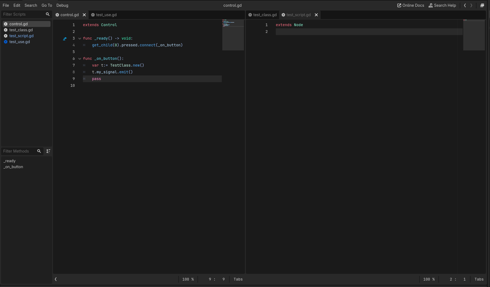

# Godot Script Tabs

Simple splittable tabs for the ScriptEditor in Godot 4.4+
Working on Linux, Mac, Windows

### **Be sure to download the zip in releases, not the repo source code.**
**If you want to use the source code for a fork or something, see below the image for more details.**

Righting click the tab or sidebar item list will show an "Open In Split" popup. You can move the selected script to an existing split or new split here.

Drag to rearrange tabs between splits. Empty splits will free themselves.

Open splits and tab order are saved between sessions.

#### Other Code
This project uses code from other plugins I am using. Instead of requiring the download of multiple projects, I instead package the files needed in the release zip.

For the source code to work, you need:
 - [EditorNodeRef](https://github.com/brohd11/Godot-Editor-Node-Ref) -> res://addons/addon_lib/editor_node_ref
 - [AddonLib](https://github.com/brohd11/Godot-Addon-Lib) -> res://addons/addon_lib/brohd
